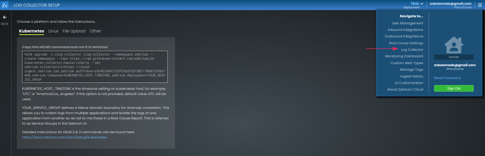

# Autonomous ML-based detection and identification of root cause for incidents in microservices running on EKS

We troubleshoot software problems by hunting through logs, looking for errors and unexpected events that might provide a clue as to what was happening. Depending on what you find, you might have to look in many different directions,and that's where you will need to draw on your experience,intuition and maybe luck. Unfortunately, this process is only getting more difficult as apps become more complex and distributed. 

In this project, we will demonstrate an alternative approach to troubleshooting that usses Zebrium machine learning (ML) platform to automatically find root cause in logs generated by an application deployed in Amazon EKS. 

## **Prerequisites**

*Active AWS account*

*AWS CLI with IAM user having admin permission*

*A free Zebrium trial account* 

### **Step 1**

**Create and configure an EKS cluster**

The first step is launching a cluster which can be done using `eksctl` or through the Amazon console. For this cluster, we will use the console but since you still need `eksctl` that also needs to be installed.

To install `eksctl`:

    $ curl --silent --location "https://github.com/weaveworks/eksctl/releases/latest/download/eksctl_$(uname -s)_amd64.tar.gz" | tar xz -C /tmp

Then:

    $ sudo mv -v /tmp/eksctl /usr/local/bin

Confirm your installation:

    $ eksctl version 

>  

**Creating an EKS role**

First we create an EKS role by login into AWS account and search for *IAM*. Select *IAM* to navigate to its console. 

>

Navigate to **Role** on the left bar and select **Create role**.

>

On the **Select trusted entity** page, select **AWS service** as trusted entity type and from the drop down under **use cases for other AWS services**, search for  **EKS**, select **EKS - Cluster** and then select **Next**. 

>

On the **Add permissions** page, the `AmazonEKSClusterPolicy` is added by default. Leave the default and select **Next**. 

>

On the **Name, review and create** page, give your role a **name** and you may add a description (optional). Scroll to the bottom of the page and select **Create role**. 

>

>

The page will refresh, and you will be navigated to all the Roles, where you will find the newly created role. 

>

### **Step 2**

 **Creating EKS Node Group role**

You need to create an IAM role for Worker nodes. Navigate to the IAM console, select **Role** on the left navigation tab and select **Create role**. 

>

On the **Select trusted entity** page, select **EC2** as the use case and then select **Next**.

>

On the **Add permissions** page, search and select the 3 policies below for provisioning worker nodes from Amazon EC2.
AmazonEKSWorkerNodePolicy
AmazonEKS_CNI_Policy
AmazonEC2ContainerRegistryReadOnly

>
>

Select **Next**.

On the **Name, review and create** page, give your role a **name** and you may add a description (optional). Review and make sure all 3 policies are on the **Add permission** section, scroll to the bottom of the page and select **Create role**. 

>

>

>

### **Step 3** 

**Creating a Cluster**

Start by searching for EKS in the search box then select **Elastic Kubernetes Service** from the options that pop up. 

>

Select **Add cluster** and then select **create**

>

On the **Configure cluster** page, use the following:

**Name**  -  type the cluster name **ml-demo**. 

**Cluster Service Role** - select the EKS role created

Leave the default setting for everything else and click **Next**. 

On the **Specify networking** page, choose your subnet. Three subnets is a good amount, leave everything else as default and click **Next**. 

>

>

Click **Next** on the **Configure logging** page and on the **Review and create** page, click **Create**

>

It will take a few minutes for the cluster to be created.

Navigate to  **clusters** on the left bar under **Amazon EKS**.

Once your cluster is created, the status will be **Active**.

>

### **Step 4**

**Adding NodeGroups**

Select the newly created cluster.

Select the **Configuration** tab, select **Compute** under **Cluster Configuration**.

>

Select **Add Node Group**.

>

On the **Configure Node Group ** page, complete the following:

**Name** - **ml-demo-ng**

**Node IAM Role** - Select created **EKSWorkers**

Leave everything else as default and select **Next**.

On the **Node Group compute configuration** page leave everything as it is except:

**AMI type** :  Amazon Linux 2(AL2_x86_64)

**Capacity type** : On-Demand

**Instance types** : t3.medium

**Disk size** : 20

**Minimum size** : 2 

**Maximum size** : 4

**Desired size** : 2

>

>

On the **Specify networking** page, click **Next**.

On the **Review and create** page,  click **Create**.

>

Navigate back to your cluster and under the **Node Groups** section, you will see the node group you created and the status should be **Active**.

>

***Connect EKS to the local terminal using AWS CLI***. Navigate to the link below to learn how
https://aws.amazon.com/premiumsupport/cle-center/eks-cluster-connection/

>

## **Zebrium**

Zebrium uses unsupervised machine learning to automatically catch software incidents and show the root cause. The technology works by finding hotspots of abnormally correlated anomalous patterns across logs and metrics. 

Zebrium log collector is a log deployed to all Nodes in your cluster and collects logs from each container. Additionally each log line has associated metadata from the Kubernetes deployment viewable in the Zebrium UI. 

**Creating a Zebrium account and installing the log collector** 

You need a free Zebrium trial account using this link

https://cloud.zebrium.com/auth/sign-up 

Navigate to the Log Collector page 

>

Copy the Helm command for Kubernetes and run it in your terminal. Remember to adjust the code before running and delete this part:

>zebrium.timezone=KUBERNETES_HOST_TIMEZONE,zebrium.>deployment=YOUR_SERVICE_GROUP
>

Run: 

    $ helm upgrade -i zlog-collector zlog-collector --namespace zebrium --create-namespace --repo https://raw.githubusercontent.com/zebrium/ze-kubernetes-collector/master/charts --set zebrium.collectorUrl=https://cloud-ingest.zebrium.com,zebrium.authToken=XXXX

>

The Zebrium UI should detect that logs are being sent within a minute or two. 

>

You have just installed and set up Zebrium.  Machine learning will begin structuring and learning the patterns in the logs from your newly created K8s environment.

### **Install and fire up the Sock Shop demo app**

Now that you have the machine learning running, we need an application that we can break to test the machine learning. 

You are going to install Sock Shop using a `YAML` config file that contains annotations for the Litmus Chaos Engine. 

    $ kubectl create -f https://raw.githubusercontent.com/zebrium/zebrium-sockshop-demo/main/sock-shop-litmus-chaos.yaml

>

Now run:

    $ kubectl get pods -n sock-shop

Wait until all the pods are in a running state (this can take a few minutes). Don’t move on until all pods are in a running state.

>

When all the services are running, you can bring up the app in your browser. You need to setup port forwarding and get the front-end IP address and port by running:

***Note: Run this in a different terminal from your current one***

    $ kubectl get pods -n sock-shop | grep front-end 

>

Now use the pod name from the command you just ran in place of **XXX’s**.

    $ kubectl port-forward front-end-XXXX-XXXX 8079:8079 -n sock-shop

>

Now open the port address from above `127.0.0.1:8079` in a new browser tab.  The Sock Shop app should open up in your browser. 

>

You can also go to CloudWatch in the AWS Console and visit the Resources page under Container Insights to verify everything looks healthy.  You can use the below link to get details on how it is done. 

https://docs.aws.amazon.com/AmazonCloudWatch/latest/monitoring/deploy-container-insights-EKS.html

### **Install the Litmus Chaos Engine**

We’re going to use the open-source Litmus chaos tool to run a chaos experiment that breaks the Sock Shop app. 

To install Litmus and create a RBAC role for the pod-network-corruption test:

    $ helm repo add litmuschaos https://litmuschaos.github.io/litmus-helm/

Then:

    $ helm upgrade -i litmus litmuschaos/litmus-core -n litmus --create-namespace

>

To setup the service account with the appropriate RBAC to run the network corruption experiment:

    $ kubectl apply -f https://raw.githubusercontent.com/zebrium/zebrium-sockshop-demo/main/pod-network-corruption-rbac.yaml

>

Now run date and make a note of the time:

    $ date

>Output:
>
>

# **Take a Two Hours Break**

This is a new EKS cluster, a new app and Zebrium account, so it is important to give machine learning a bit of time to learn the normal log patterns. We recommend waiting at least two hours before proceeding with the next steps. 

### **Run a network corrupt choas experiment to break the Sock Shop app**

Now that ML has had a chance to get a baseline of the logs, you will break the environment by running a Litmus network corruption chaos experiment. 

To start the network corruption, run:

    $ kubectl apply -f https://raw.githubusercontent.com/zebrium/zebrium-sockshop-demo/main/pod-network-corruption-chaos.yaml

>

Then run:

    $ date

>

 Now get the experiment started by running: 

    $  kubectl get pods -n sock-shop -w

>

It takes awhile for the experiment to start, so you have to wait until the `pod-network-corruption-helper` goes into a Running state.  Click **shift C `(^C)`** once everything is running. 

Refresh your Sock Shop UI, you might notice some operations failing or not operating the way it should. 

>

In my case, there was no visible change, except the time it took for an item to be added into the cart. Yours will be different but we will use Zebrium to understand the issue that has occurred. 

***Note:
If the browser does not show up, rerun the below in a different terminal***.

    $ kubectl port-forward front-end-XXXX-XXXX 8079:8079 -n sock-shop

Now if you refresh your browser, the Sock Shop app should appear.

***Note: The chaos test will run for two minutes, wait for it to complete before proceeding to the next step***.

## **The results and how to interpret them**

Give the machine learning a few minutes to detect the problem (between 2 and 10minures) and then refresh your browser windows until you see one or more new root cause reports (UI refresh is not automatic). 

>

I tried the above procedure several times and got results after each run. However, the actual root cause reports were different across runs. This is because of many factors, including the learning period, what events occurred while learning, the timing and order of the log lines while the experiment was running, other things happening on the system, and so on.

Below is an examples and its explanation

**Important**: We recommend that you read this section carefully as it will help you interpret the results when you try this on your own.

### **Results example 1**

**Reporting page shows the first clue**

The Reporting page contains a summary list of all the root cause reports found by machine learning. After running the chaos experiment, this was a root cause on my report page.

>

There are three useful parts of the summary:

1. ***Plain Language NLP Summary*** - This is an experimental feature where the `GPT-3 language model` is used to construct a summary of the report. The summary may not be perfect but it gives us some useful context about the problem. In my case the Id Hex field is invalid. 

    >

2. ***Log type(s) and host(s)*** - You see the host and log types (front end, events, orders, and messages) that contain the events for this incident.

    >

3. ***One or two log “Hallmark” events*** -  The ML picks out one or two events that it thinks will characterize the problem. In this case, there is an invalid id hex. 

    >

### **Viewing the report details shows the root cause and symptoms**

Clicking on the summary lets you drill down into the details of the root cause report. The core events represent the cluster of correlated anomalies that the ML picks out. The most important ones are the events that are either “rare” or”bad”.

>

In this example, there are 5 events and this is shown on the left side of the screen. On the right, you can see the events themselves. 

>

It’s interesting to note the variance in the structure of these events. Fortunately, the ML automatically learns how to parse, structure, and categorize each different type of event!

## **Conclusion** 

The process of  troubleshooting and tracking down the root cause of an incident in a distributed application can be difficult and time consuming. 

In this project, you have induced failure in your Sock SHop application  using Chaos engineering by running a Litmus network corruption chaos experiment. The Zebrium machine learning technology was able to detect this chaos and build a root cause report that detailed the root cause. 

Zebrium is even more compelling when used with real applications. The machine learning will both proactively detect new/unknown issues without requiring rules as well as find the root cause of any kind of software failure. 

## **Clean Up**

To avoid charges on our AWS account for resources we are no longer using, we need to delete them.

### **Delete Clusters and Node Group** 

Navigate to the Amazon EKS console. Under clusters, click on **ml-demo** the cluster you created.

Navigate  to the compute tab under configuration, select the nodegroup you created and delete it.

Once the node group has been deleted, click **Delete cluster** to delete your cluster.

>

## ***Congratulations!!! You have successfully completed this project***
 

